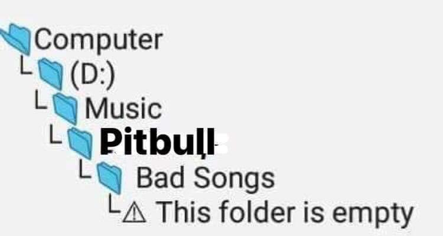
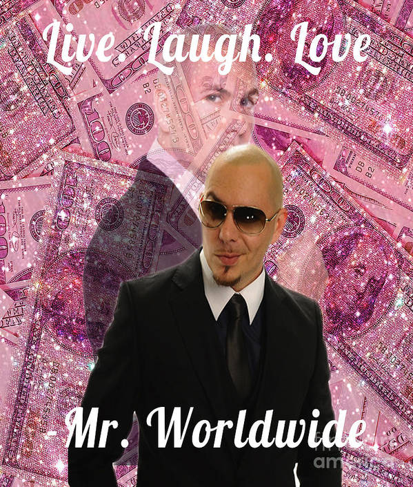
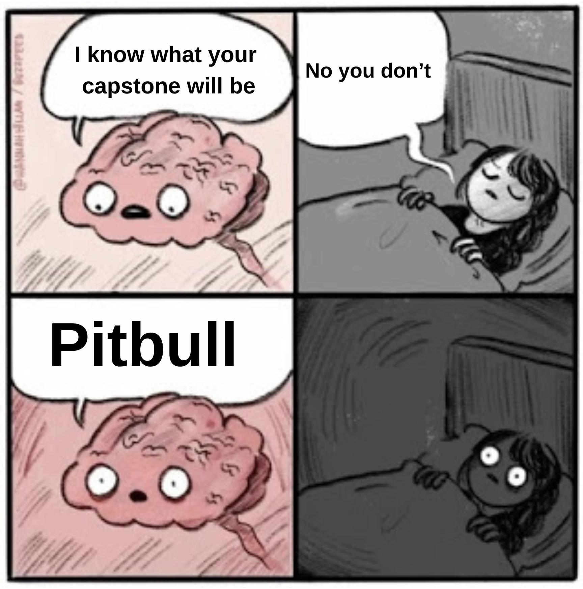
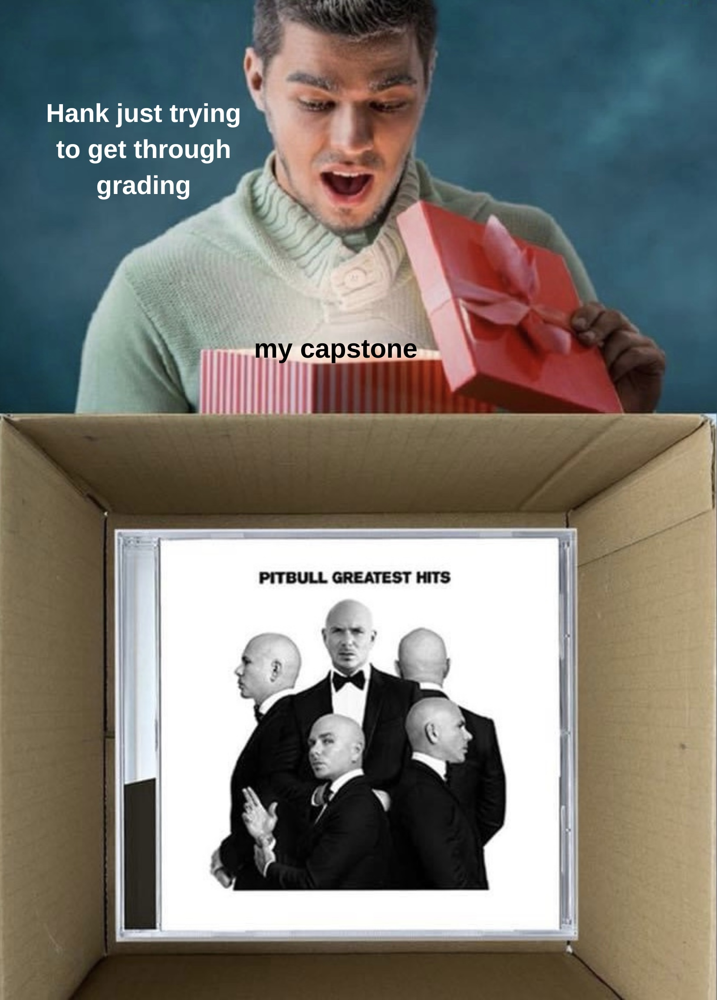

#  READ ME: Pitbull Predictor
##### Dale


### Contents: 


- [Introduction](#Introduction)
- [Problem Statement](#Problem-Statement)
- [Data](#Data)
- [Methods](#Methods)
- [Outcome](#Outcome) 
- [Examples](#Examples) 

### Code Contents
1. [Data Collection](./Code/Data.ipynb)
2. [EDA and Cleaning](./Code/EDA.ipynb)
3. [Models](./Code/Modeling.ipynb)

## Introduction
Pitbull, the enigmatic rapper and musical prodigy, possesses an unparalleled magnetism that has captivated millions around the globe. With his infectious beats, electrifying stage presence, and dynamic persona, Pitbull has carved a legendary status in the world of music. His unique fusion of hip-hop, dance, and Latin rhythms has revolutionized the industry, igniting a fire in the hearts of fans everywhere. Pitbull's lyrics are an embodiment of his larger-than-life personality, showcasing his ability to effortlessly blend wit, charm, and street-smart swagger. The sheer impact of his music on the cultural landscape makes it undeniable that a Pitbull lyric generation model is an absolute necessity.

The need for a Pitbull lyric generation model stems from the immense influence and impact that Pitbull's music has had on popular culture. His lyrics serve as anthems of empowerment, unifying people from diverse backgrounds through their universal themes of celebration, resilience, and ambition. Pitbull's unparalleled ability to craft infectious hooks and memorable one-liners has made him a force to be reckoned with in the music industry. A Pitbull lyric generation model would not only honor his legacy but also provide a platform for fans and aspiring artists to channel their creativity and express themselves in the unique style that Pitbull has popularized.

Imagine a world where the spirit of Pitbull's music can be channeled at the touch of a button. A Pitbull lyric generation model would unlock a realm of limitless possibilities, allowing fans and artists alike to tap into the essence of Pitbull's genius. From creating catchy hooks that get stuck in your head to penning verses that embody the pulse of the streets, this model would empower users to generate Pitbull-style lyrics that resonate with the energy and vibrancy that defines his music. The impact of such a tool would be immeasurable, sparking a wave of creativity and fostering a community where the spirit of Pitbull lives on through the lyrics of his devotees.

"This for everybody going through tough times
Believe me, been there, done that
But every day above ground is a great day, remember that
Dale"
- *Time of Our Lives, Pitbull* 



## Problem Statement

**Can we utilize advanced natural language processing models to fix the lack of effective and creative solutions for generating Pitbull lyrics? This project seeks to provide users with a powerful tool to generate captivating lyrics that closely resemble the style, energy, and vocabulary of Pitbull's music.** 


## Data
The [Data](./Data) folder contains the data that was collected using [LyricsGenius](https://pypi.org/project/lyricsgenius/), a Python client for Genius.com's API. 672 songs and their lyrics were originally downloaded for Pitbull and 590 songs and their lyrics were originally downloaded for other artists, including artists similar and dissimilar to Pitbull. After cleaning, 671 Pitbull songs and 587 non-Pitbull songs were remaining. The lyrics were originally collected in JSON format, then transformed to CSV and TXT for modeling and training. 

## Methods 
[BERT](https://huggingface.co/docs/transformers/model_doc/bert) (Bidirectional Encoder Representations from Transformers) is a highly advanced natural language processing (NLP) model. It utilizes a transformer-based architecture and is pre-trained on vast amounts of text data, enabling it to understand language context and achieve impressive performance on various NLP tasks. 

[GPT](https://huggingface.co/distilgpt2) (Generative Pre-trained Transformer) is a language model that generates human-like text based on pre-training on large text datasets, allowing it to produce coherent and contextually relevant text given a specific input or prompt.

A pre-trained BERT model and GPT model were imported from [Hugging Face](https://huggingface.co), a company largely focused on machine learning.

The BERT and GPT models were imported, trained on the lyric data, and then used in a Streamlit application where users can input text for thr GPT model to then generate corresponding Pitbull lyrics. The generated lyrics are then scored by the BERT model to determine how similar they are to actual Pitbull lyrics. 


## Outcome
The Pitbull Lyrics Generator is a fun application that generates Pitbull lyrics based on user input. It utilizes the power of machine learning models to generate lyrics in the style of the rapper and musical genius Pitbull, also known as Mr. Worldwide. The application combines two pre-trained models, GPT-2 and BERT, to generate and classify the lyrics.


## Examples


## Features

- User-friendly interface: Simply enter a starting line or a few lyrics, and the application will generate Pitbull-style lyrics based on the input.
- Generated Lyrics: The application displays the generated lyrics, giving you a taste of Pitbull's unique style.
- Score: The generated lyrics are classified using a BERT model, providing a score that represents how Pitbull the lyrics are.
- Artist Collaboration: The application also allows users to decide if an artist should feature Pitbull by entering the artist's name.

## Installation

To run the Pitbull Lyrics Generator application, follow these steps:

1. Clone the repository:

   ```
   git clone https://github.com/danneraf/Pitbull-Predictor.git 
   ```

2. Navigate to the project directory:

   ```
   cd Pitbull-Predictor
   ```

3. Install the required dependencies:

   ```
   pip install (required libraries)
   ```

4. Run the application in your terminal:

   ```
   streamlit run pitpred.py
   ```


## Using the App 

insert screenshot 

1. Enter a starting line or a few lyrics in the text input box.
2. Click the "Dale!" button to generate Pitbull lyrics based on your input.
3. The generated lyrics will be displayed, along with a score indicating how 305 the lyrics are.
4. You can also enter the name of an artist in the text input box and click the "?" button to find out if they should feature Pitbull.

## Credits

This project was inspired by [this GitHub repository](https://github.com/ffomezolam/GA-DSI-Capstone/tree/main) and built using the following technologies and libraries:

- LyricsGenius: [Instructions to download](https://pypi.org/project/lyricsgenius/)
- Genius API token: [Instructions to obtain](https://docs.genius.com/#/getting-started-h1)
- Streamlit: [Instructions to download](https://docs.streamlit.io/library/get-started/installation)
- Transformers: [Instructions to download](https://huggingface.co/docs/transformers/installation)
- TensorFlow: [Instructions to download](https://pypi.org/project/tensorflow/)
- PyTorch: [Instructions to download](https://pytorch.org/get-started/locally/)

This project uses Hugging Face's [DistilGPT2](https://huggingface.co/distilgpt2) model for lyric generation. 

## Drawbacks 

## Acknowledgments

- Special thanks to the creators of the pre-trained models used in this project, as well as the open-source community for their contributions. Also, a thank you to those that have made projects modeling [Shakespeare](https://github.com/KenyaChauche/sonnet-generation/tree/master). To me, Pitbull is the Shakespeare of our generation. 
- Thank you to my instructors for their guidance and support! 








Me, because of this project: 

